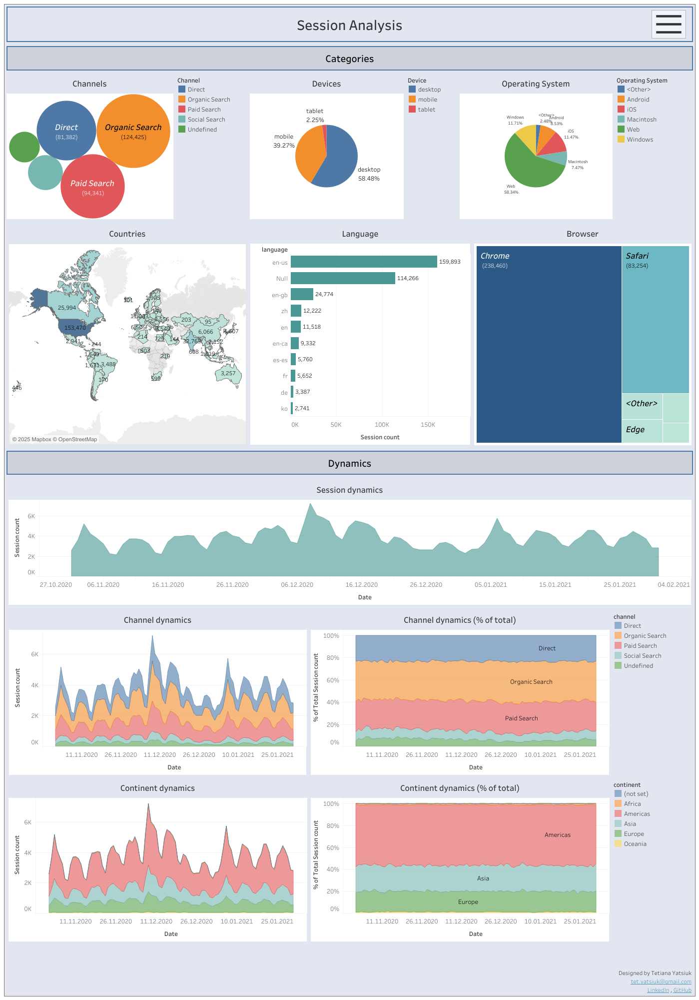
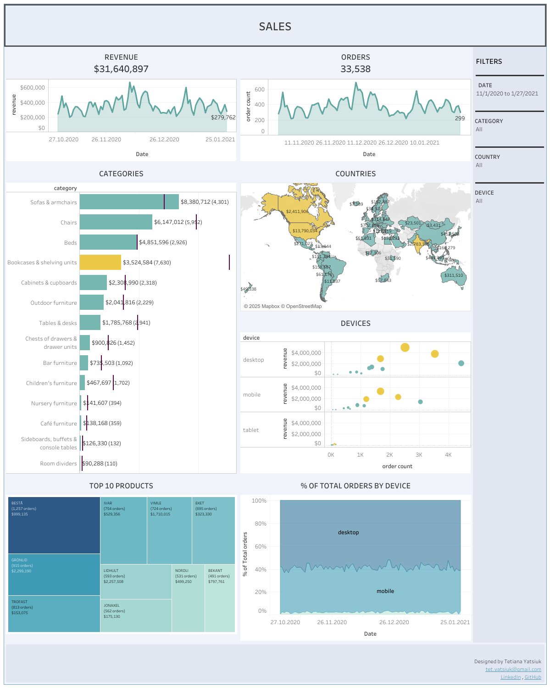
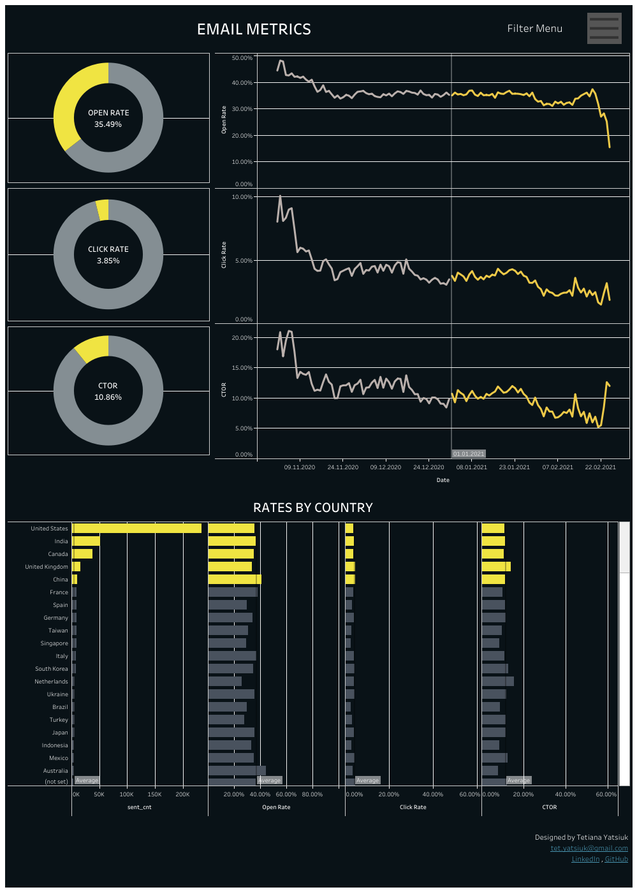

# 🛒 E-commerce Dashboards – Furniture Store Analytics

This project is based on an **e-commerce database hosted in BigQuery**, using data from a **furniture store website**. The goal is to analyze different aspects of user behavior, sales performance, and email engagement through interactive dashboards built in **Tableau**.

> 📊 Dashboards include:
> - Session Analysis Dashboard  
> - Sales Dashboard  
> - Email Metrics Dashboard

 

## 🔧 Technologies Used

- **SQL (BigQuery)** – querying and aggregating raw data  
- **Tableau** – data visualization and dashboard creation

 

## 📈 Dashboards Overview

### 1. Sessions Analysis Dashboard  
  
**Description:** _[To be added]_  
🔗 [View on Tableau Public](https://public.tableau.com/views/SessionAnalysisDashboard/SessionAnalysis?:language=en-US&:sid=&:redirect=auth&:display_count=n&:origin=viz_share_link)
📁 [Download .twbx file](.twbx)
---

### 2. Sales Dashboard  
  
**Description:** _[To be added]_  
🔗 [View on Tableau Public](https://public.tableau.com/views/SalesDashboard_17490443787670/SALES?:language=en-US&:sid=&:redirect=auth&:display_count=n&:origin=viz_share_link)
📁 [Download .twbx file](Sales_Dashboard.twbx)
---

### 3. Email Dashboard  
  
**Description:** _[To be added]_  
🔗 [View on Tableau Public](https://public.tableau.com/views/EMAILMETRICSDASHBOARD/EMAILMETRICS?:language=en-US&:sid=&:redirect=auth&:display_count=n&:origin=viz_share_link)
📁 [Download .twbx file](Email_Metrics_Dashboard.twbx)
---

## 📌 Key Objectives

- Analyze account creation and user session behavior  
- Evaluate sales trends and revenue across countries  
- Track email campaign performance (sent, opened, clicked)  
- Segment users by activity and preferences

 

## ✨ Outcomes

- Clear identification of high-performing user segments  
- Insight into session frequency and conversion efficiency  
- Visual comparison of engagement across regions and channels

---

## 🔗 Author & Contact

Created by [Your Name]  
Feel free to reach out via GitHub or LinkedIn for questions or collaboration.
